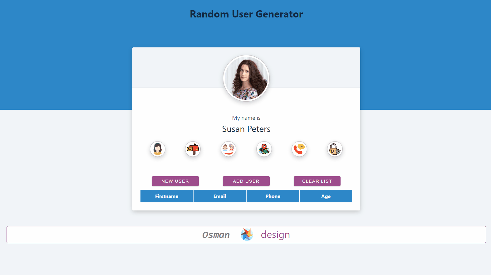

## Check The Live Website ➡️ [Live Website](https://osmankoyuncuu.github.io/react-random-user-v2/)

## Animation of the Website

## Description

Project aims to create a random user.

## Project Skeleton

    react-random-user-v2
    |
    ├── public
    │     └── index.html
    │     └── favicon.ico
    ├── src
    │    ├── assets
    │    │       ├── desing.svg
    │    │       ├── growin-up-man.gif
    │    │       ├── growin-up-woman.svg
    │    │       ├── mail.svg
    │    │       ├── map.gif
    │    │       ├── padlock.svg
    │    │       ├── phone.svg
    │    │       └── woman.svg
    │    ├── components
    │    │       └── Footer
    │    │             ├── Footer.css
    │    │             └── Footer.jsx
    │    ├── App.js
    │    ├── index.css
    │    └── index.js
    ├── .gitignore
    ├── package.json
    ├── random-user-v2.gif
    ├── README.md
    └── yarn.lock

## Overview

I mastered HTML, CSS and React features in this project. You can see the visual representation of the website above.
